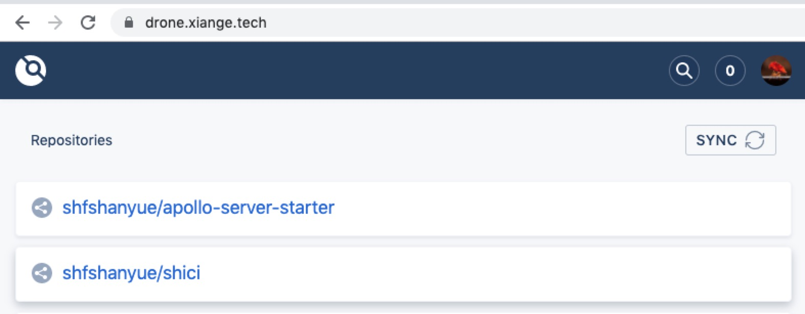

# 使用 helm 部署 drone.ci

至于如何使用 helm，可以参考我以前的文章: []()

> 为了更好地真实环境效果，在命令演示过程中我会使用我真实的域名: `drone.xiange.tech`，你需要替换成你自己的域名

部署时采用 helm 的官方 chart: [stable/drone](https://github.com/helm/charts/tree/master/stable/drone)

当我们选择结合 `github` 做CI，此时需要两个参数

1. `github oauth2 client-secret`
1. `github oauth2 client-id`

``` bash
# 根据 github oauth2 的 client-secret 创建一个 secret
# generic: 指从文件或者字符串中创建
# --form-literal: 根据键值对字符串创建
$ kubectl create secret generic drone-server-secrets --from-literal=clientSecret="${github-oauth2-client-secret}"

# 使用 helm v3 部署 stable/drone
$ helm install drone stable/drone
```

此时部署会提示部署失败，我们还需要一些必要的参数: `Ingress` 以及 `github oauth2`

我们使用 `Ingress` 配置域名 `drone.xiange.tech`，并开启 `https`，关于如何使用 `Ingress` 并自动开启 `https`，可以参考我以前的文章:

1. [通过外部域名访问你的应用: Ingress](https://shanyue.tech/k8s/ingress)
1. [自动为你的域名添加 https](https://shanyue.tech/k8s/https)

同时你也需要配置好默认 pv/pvc，可以参考我以前的文章

1. [k8s 中的永久存储: PersistentVolume]()

配置相关的参数，存储为 `drone-values.yaml`，其中 `drone.xiange.tech` 是在 github 上为 `drone` 设置的回调域名

``` yaml
ingress:
  ## If true, Drone Ingress will be created.
  ##
  enabled: true

  ## Drone Ingress annotations
  ##
  annotations:
    kubernetes.io/ingress.class: nginx
    kubernetes.io/tls-acme: 'true'

  ## Drone hostnames must be provided if Ingress is enabled
  ##
  hosts:
    - drone.xiange.tech

  ## Drone Ingress TLS configuration secrets
  ## Must be manually created in the namespace
  ##
  tls:
    - secretName: drone-tls
      hosts:
        - drone.xiange.tech

server:
  ## If not set, it will be autofilled with the cluster host.
  ## Host shoud be just the hostname.
  ##
  host: drone.xiange.tech

sourceControl:
  ## your source control provider: github,gitlab,gitea,gogs,bitbucketCloud,bitbucketServer
  provider: github
  ## secret containing your source control provider secrets, keys provided below.
  ## if left blank will assume a secret based on the release name of the chart.
  secret: drone-server-secrets
  ## Fill in the correct values for your chosen source control provider
  ## Any key in this list with the suffix  will be fetched from the
  ## secret named above, if not provided the secret it will be created as
  ##  using for the key "ClientSecretKey" and
  # "clientSecretValue" for the value. Be awere to not leak shis file with your password
  github:
    clientSecretKey: clientSecret
    server: https://github.com
```

准备好 `values` 之后，`helm upgrade` 更新 chart 再次部署

``` bash
$ helm upgrade drone --reuse-values --values drone-values.yaml \ 
  --set 'sourceControl.github.clientID={github-oauth2-client-id}' stable/drone
Release "drone" has been upgraded. Happy Helming!
NAME: drone
LAST DEPLOYED: 2019-10-31 15:27:53.284739572 +0800 CST
NAMESPACE: default
STATUS: deployed
NOTES:
*********************************************************************************
***        PLEASE BE PATIENT: drone may take a few minutes to install         ***
*********************************************************************************
From outside the cluster, the server URL(s) are:
     http://drone.xiange.tech
```

查看 `deployment` 状态，部署成功

``` bash
$ kubectl get deploy drone-drone-server
NAME                 READY   UP-TO-DATE   AVAILABLE   AGE
drone-drone-server   1/1     1            1           6h44
```

打开浏览器，查看域名 `drone.xiange.tech`，经过 `github` 授权后可以看到 `drone.ci` 的管理页面

