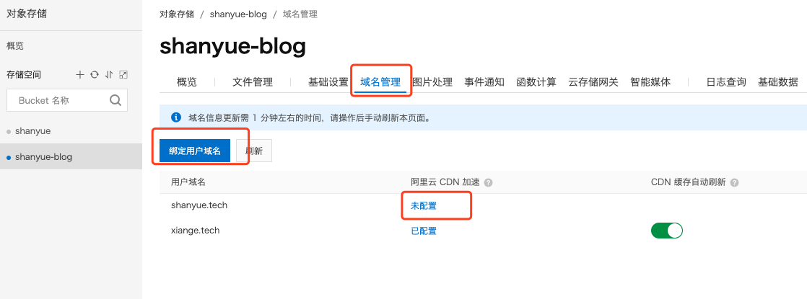
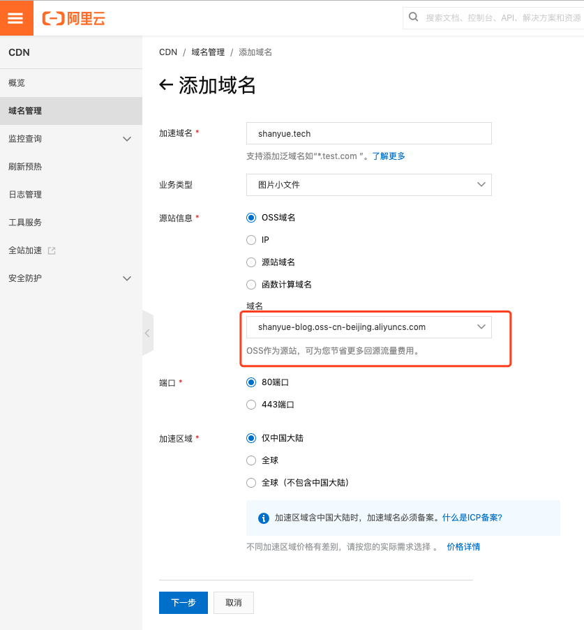
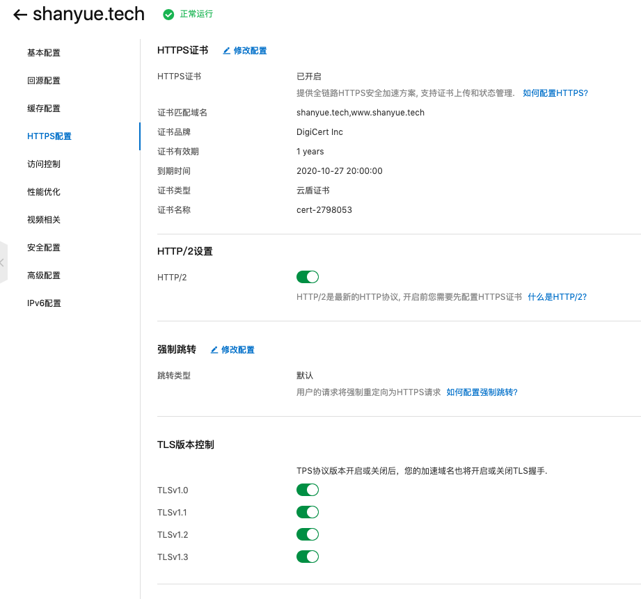
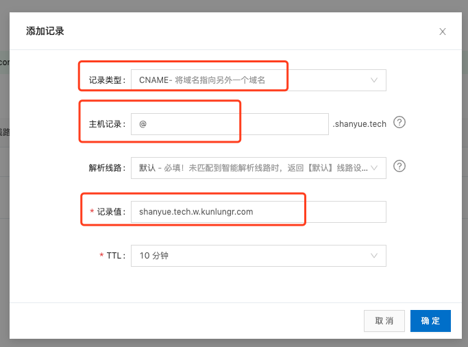
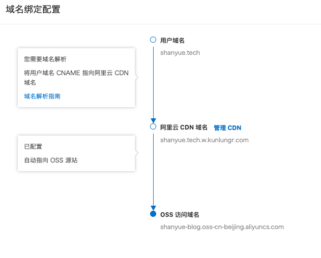
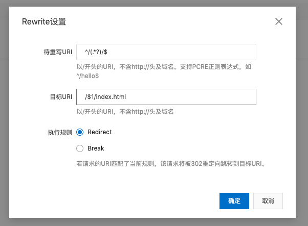
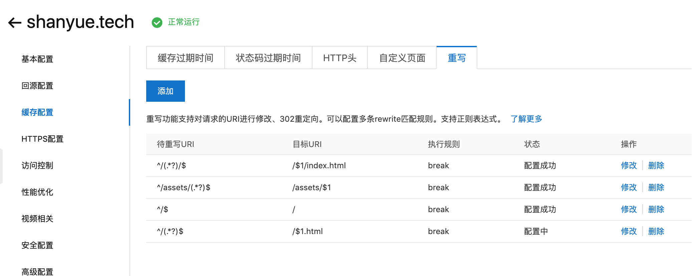
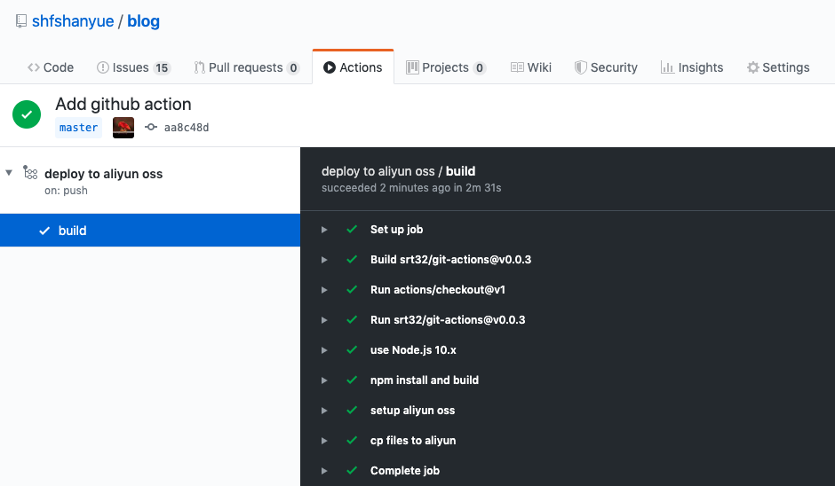

# 在阿里云OSS托管你的个人网站

`OSS` 即 `object storage service`，对象存储服务。我们可以通过阿里云的 `OSS` 来托管自己的前端应用，个人网站或者博客

在 [使用 netlify 托管你的前端应用](https://github.com/shfshanyue/op-note/blob/master/deploy-fe-with-netlify.md) 中我也介绍到另一种专业的网站托管服务平台 `netlify`。那相比 `netlify`，阿里云的 oss 有什么好处呢？只有一个，网络问题，并且可以结合阿里云的CDN使用。

如果你的域名已经备案，且执着于网络时延，推荐在阿里云的 `oss` 部署你的应用。你可以直接在阿里云官网购买 `oss`，**按量付费**，对于个人来说，每个月的花费不足一块。

<!--more-->

+ 原文链接: [在阿里云OSS托管你的前端应用](https://github.com/shfshanyue/op-note/blob/master/deploy-fe-with-alioss.md)
+ 系列文章: [个人服务器运维指南](https://github.com/shfshanyue/op-note)

## 新建 Bucket 及设置

`Bucket` 是 OSS 中的存储空间。可以跳转到阿里云的 OSS 控制台，根据官方文档 [创建 Bucket](https://help.aliyun.com/document_detail/31885.html?spm=a2c4g.11186623.6.575.51d628bco7rs4U) 创建 `Bucket`。

Bucket 新建成功后，点击 `基础设置` 标签页

1. 配置读写权限为 **公共读**

1. 配置静态页面，默认首页是 `index.html`，404 页面是 `404.html`(根据你的错误页面而定)

## 上传文件

我们可以使用点击上传按钮或者拖拽的方式来上传文件。但是不方便自动化，我们可以选择使用阿里云的工具 `ossutil` 来上传文件，详细文档参考 [ossutil](https://help.aliyun.com/document_detail/120057.html?spm=a2c4g.11186623.2.18.5a777815w2WDpM#section-2ju-iy1-c1g)

``` bash
$ ossutil cp -rf .vuepress/dist oss://shanyue-blog/
```

使用 `ossutil` 时，需要创建 `access key`，参考文档 [创建AccessKey](https://help.aliyun.com/document_detail/53045.html?spm=a2c4g.11186623.2.20.607a448azQVK0g#task-1715673)

## 绑定域名以及开通 CDN

在阿里云的 OSS 控制台，选中 Bucket，点击域名管理标签页，绑定用户域名，并配置CDN加速，一路确认





## 申请证书



## CNAME





## Trailing slash 问题与 http rewrite

+ `/posts/` -> `/posts/index.html`
+ `/about` -> `/about.html`




## 使用 github actions 自动部署

最后只需要配置自动部署了，这里使用 `github actions`，具体细节参考我的上一篇文章: [github actions 入门指南及实践](https://github.com/shfshanyue/op-note/blob/master/github-action-guide.md)

在 github 上可以参考我的配置 [shfshanyue/blog](https://github.com/shfshanyue/blog/blob/master/.github/workflows/nodejs.yml)

``` yaml
name: deploy to aliyun oss

on: [push]

jobs:
  build:

    runs-on: ubuntu-latest

    steps:
    # 切代码到 runner
    - uses: actions/checkout@v1
      with:
        submodules: true
    # 下载 git submodule
    - uses: srt32/git-actions@v0.0.3
      with:
        args: git submodule update --init --recursive
    # 使用 node:10
    - name: use Node.js 10.x
      uses: actions/setup-node@v1
      with:
        node-version: 10.x
    # npm install
    - name: npm install and build
      run: |
        npm install
        npm run build
      env:
        CI: true
    # 设置阿里云OSS的 id/secret，存储到 github 的 secrets 中
    - name: setup aliyun oss
      uses: manyuanrong/setup-ossutil@master
      with:
        endpoint: oss-cn-beijing.aliyuncs.com
        access-key-id: ${{ secrets.OSS_KEY_ID }}
        access-key-secret: ${{ secrets.OSS_KEY_SECRET }}
    - name: cp files to aliyun
      run: ossutil cp -rf .vuepress/dist oss://shanyue-blog/
```

部署成功


