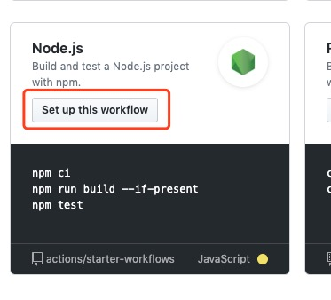
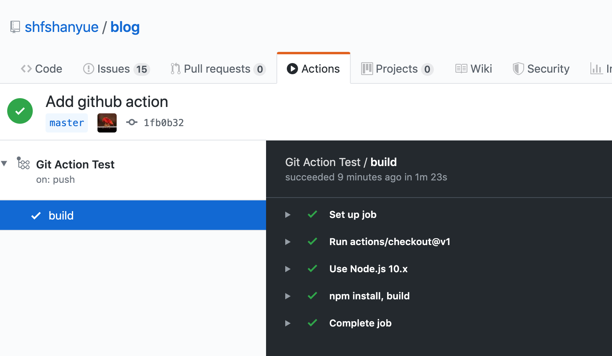
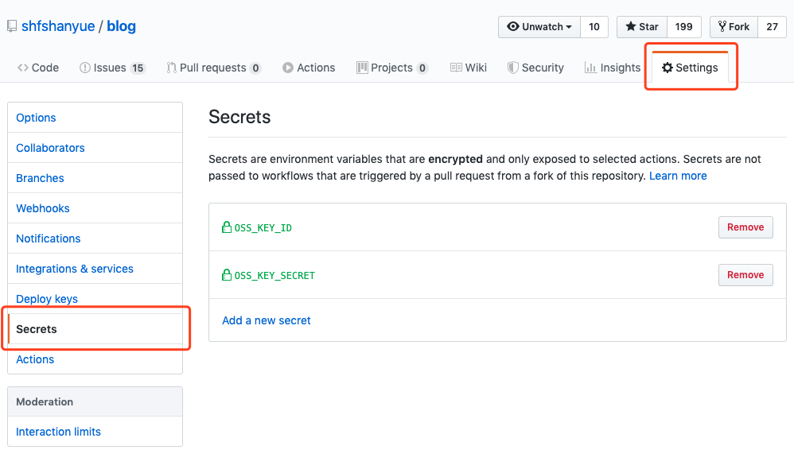

# github actions 入门指南及实践

自从 `github` 提供了 `github actions` 后，个人或者依赖于 `github` 的公司可以考虑把持续集成方案迁到 `github actions`。

`github` 会提供一个以下配置的服务器做为 runner，可以说相当良心了。

+ 2-core CPU
+ 7 GB of RAM memory
+ 14 GB of SSD disk space

另外如果你有网络时延的需求，（比如推送及拉取镜像时产生的网络时延），你也可以自建 runner。

本文将介绍 `github actions` 的用法，以及如何使用它自动部署个人博客或者前端应用

<!--more-->

+ 原文链接: [github actions 入门指南及实践](https://github.com/shfshanyue/op-note/blob/master/github-action-guide.md)
+ 系列文章: [个人服务器运维指南](https://github.com/shfshanyue/op-note)

## 快速开始

在 `github` 上进入个人仓库，找到 `Actions` 的标签页


如果你是一个前端项目，可以使用 `Node.js` 的模板，点击 `Set up this workflow`



此时生成了一个文件 `.github/workflows/nodejs.yaml`，修改内容如下

``` yaml
name: Git Action Test

on: [push]

jobs:
  build:

    runs-on: ubuntu-latest

    steps:
    - uses: actions/checkout@v1
    - name: Use Node.js 10.x
      uses: actions/setup-node@v1
      with:
        node-version: 10.x
    - name: npm install, build
      run: |
        npm install
        npm run build --if-present
      env:
        CI: true
```

执行 `git push` 操作，此时可以在 `github` 的 `Actions` 标签页看到执行结果



## 术语

+ `runner`: github 分配的用来执行 CI/CD 的构建服务器 (也可以自建 runner)
+ `workflow`: CI/CD 的工作流
+ `job`: 任务，比如构建，测试和部署。每个 `workflow` 由多个 `job` 组成
+ `step`: 每个 `job` 由多个 `step` 组成

## 配置

参考官方文档: [Workflow syntax for GitHub Actions](https://help.github.com/en/actions/automating-your-workflow-with-github-actions/workflow-syntax-for-github-actions)

### on

该 CI/CD 触发时的事件。如果需要上传代码自动部署的功能时，应该选择 `on: push`

``` yaml
on: push
```

更多事件可以参考官方文档 [Events that trigger workflows](https://help.github.com/en/actions/automating-your-workflow-with-github-actions/events-that-trigger-workflows#about-workflow-events)

另外，我们可以利用 `issues` 事件做很多事情，如邮件通知之类

> 如果是 Issue 类博客，则可以通过监听 `issues.opened` 事件，调用 `github api`，自动生成网址博客

``` yaml
on:
  issues:
    types: [opened, edited, milestoned]
```

### jobs

一个 CI/CD 的工作流有许多 `jobs` 组成，比如最典型的 job 是 `lint`，`test`，`build` 或者 `deploy`。

``` yaml
jobs:
  test:
  build: 
  deploy:
```

所有的 `job` 都是并行的，但往往会有依赖关系：**你总得通过测试了，才能再去部署吧**

### jobs.<job_id>.needs

`needs` 确定 `job` 的依赖关系

``` yaml
jobs:
  test:
  deploy:
    needs: test
```

### jobs.<job_id>.runs-on

当你使用 `github actions` 时，github 会十分大方的给你分配一个配置还不错的服务器作为构建服务器，用来跑你的 `workflow`

+ 2-core CPU
+ 7 GB of RAM memory
+ 14 GB of SSD disk space

恩，比我自己的服务器要强

使用 `runs-on` 指定服务器系统，用的最多的应该就是 `ubuntu-latest` 了

``` yaml
runs-on: ubuntu-latest

runs-on: windows-latest
```

### jobs.<job_id>.steps

即某个任务的一系列动作，如部署一个前端需要安装依赖，编译代码等等

### jobs.<job_id>.steps.name

为 step 指定一个名称，将会在 `github action` 的控制台中显示

### jobs.<job_id>.steps.run

该 step 需要在 `shell` 中执行的命令

``` yaml
# 单行
- name: Install Dependencies
  run: npm install

# 多行
- name: Install and Build
  run: |
    npm install
    npm run build
```

### jobs.<job_id>.steps.uses

选择一个 `action`，可以理解为若干 `steps.run`，有利于代码复用。这也是 `github action` 最主要的功能。

如果你想找一个好用的 `github action`，可以在 `github marketplace` 浏览并检索

这是一个在当前操作系统中安装 `node:10` 的 action 示例

``` yaml
- name: use Node.js 10.x
  uses: actions/setup-node@v1
  with:
    node-version: 10.x
```

当然，这里怎么能少得了 `docker` 的身影呢，在 `actions` 中也可以使用 `docker`。如果对 `docker` 不太了解，可以看我的文章: [docker 简易入门](https://github.com/shfshanyue/op-note/blob/master/docker.md)

以下是 `npm install` 的一个示例

``` yaml
jobs:
  build:
    steps:
      - name: Install
        uses: docker://node:alpine
        with:
          args: npm install
```

## secret and context

如何在 `github action` 上访问敏感数据？如使用 `ssh` 登录时如何维护密码。

我们可以在 github repo 上依次点击 `Settings` -> `Secrets` 设置 `secret`



``` yaml
- name: setup aliyun oss
  uses: manyuanrong/setup-ossutil@master
  with:
    endpoint: oss-cn-beijing.aliyuncs.com
    access-key-id: ${{ secrets.OSS_KEY_ID }}
    access-key-secret: ${{ secrets.OSS_KEY_SECRET }}
```

这里的 `secret` 就是一种 `context`，描述 CI/CD 一个 `workflow` 中的上下文信息，使用 `${{ expression }}` 语法表示。除了 `secret`，还有

+ `github`: `workflow` 的信息，如 `github.sha` 可以获取当前的 `commit SHA`，我们可以利用它为 `sentry` 或者 `docker image` 打入版本号
+ `env`: 环境变量
+ `job`: 当前执行 `job` 的信息，如 `job.status` 表示当前 `job` 的执行状态
+ `matrix`: 描述一些构建信息，如 `node` 以及 `os` 版本号

更多 `context` 信息可以参考官方文档 [Contexts and expression syntax for GitHub Actions](https://help.github.com/en/actions/automating-your-workflow-with-github-actions/contexts-and-expression-syntax-for-github-actions#job-context)

## 实践自动部署

我的博客目前托管在阿里云OSS上，以下 `action.yaml` 描述了自动部署的流程。可以参考我的配置 [shfshanyue/blog](https://github.com/shfshanyue/blog/blob/master/.github/workflows/nodejs.yml)

``` yaml
name: deploy to aliyun oss

on: [push]

jobs:
  build:

    runs-on: ubuntu-latest

    steps:
    # 切代码到 runner
    - uses: actions/checkout@v1
      with:
        submodules: true
    # 下载 git submodule
    - uses: srt32/git-actions@v0.0.3
      with:
        args: git submodule update --init --recursive
    # 使用 node:10
    - name: use Node.js 10.x
      uses: actions/setup-node@v1
      with:
        node-version: 10.x
    # npm install
    - name: npm install and build
      run: |
        npm install
        npm run build
      env:
        CI: true
    # 设置阿里云OSS的 id/secret，存储到 github 的 secrets 中
    - name: setup aliyun oss
      uses: manyuanrong/setup-ossutil@master
      with:
        endpoint: oss-cn-beijing.aliyuncs.com
        access-key-id: ${{ secrets.OSS_KEY_ID }}
        access-key-secret: ${{ secrets.OSS_KEY_SECRET }}
    - name: cp files to aliyun
      run: ossutil cp -rf .vuepress/dist oss://shanyue-blog/
```

部署成功


