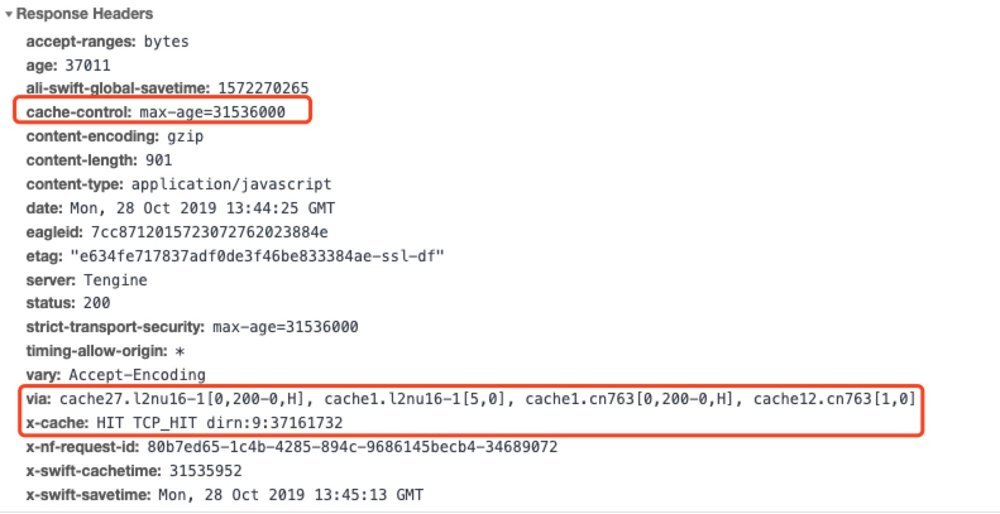

# 如果你想搭建一个博客

如果你只想搭建一个博客，那么你很可能不需要一个服务器，而且会更容易些

如果你需要在个人服务器上部署，有可能会经历以下步骤:

1. 配置反向代理，你需要了解 nginx 或者 traefik 的配置
1. 配置 https，使用 lets encrypt 生成证书
1. 使用 cron 定期更新证书
1. 手动部署：需要每次部署都需要登录服务器
1. 自动部署：结合 github/gitlab 配置 CI/CD
1. 如果自动部署，有可能使用到 docker 与 docker-compose (有可能自建 docker repo)
1. 如果服务器在阿里云买的有可能还需要备案

当然，如果你有一个完整的 `kubernetes` 环境，后期工作量相对就会简单很多，你也需要

1. 使用 k8s 结合 ingress 自动生成证书 (一次性工作)
1. 使用 helm 创建 chart
1. 构建 docker 镜像 (有可能自建 docker repo)
1. 结合 github/gitlab 配置 CI/CD

> 这也是在 k8s 上部署前后端应用的一般流程


相对而言使用一个静态网站网站托管服务，复杂度与工作量就会少了很多，毕竟它部署时只需要维护若干静态文件。也更适合刚接触博客搭建或者没有服务器的同学

<!--more-->

+ 原文链接: [如果你想搭建一个博客](https://shanyue.tech/op/if-you-want-a-blog)
+ 系列文章: [个人服务器运维指南](https://shanyue.tech/op)

## 00 架构

根据你的域名有没有备案以及对网络时延的要求，可以选择以下两种方案

1. `react/vue/angular` + `github` + `netlify` + `cloudflare`，适合域名没有进行备案且主要服务于国外的同学
1. `react/vue/angular` + `github` + `github actions` + `alioss` + `alicdn`，适合域名在国内进行备案的同学


## 01 选择一款静态网站生成器

动态博客应用状态过重，复杂性过高，不便于部署与迁移。无状态的静态博客是一个不错的选择。

如果你不想折腾数据库，那你可以选择一个静态网站生成器: 你只需要喂给它一大堆 markdown，它就会生成一些静态文件。

至于生成器，这是我曾经使用过的，感觉都很不错，你可以任选一款，如何构建参考官方文档。

+ [hugo](https://github.com/gohugoio/hugo): github star 39k。使用 go 开发，是我用过的构建最快的生成器，它的简介也只有一句话: `The world’s fastest framework for building websites.`，不过我自我感觉它的主题样式略少。如果你想定制，那你需要对 `go` 语言的 `template` 有些了解。
+ [hexo](https://github.com/hexojs/hexo): github star 28.4k。使用 node 开发，主题样式多，我还是较为喜欢这一点。
+ [vuepress](https://github.com/vuejs/vuepress): github star 14.5k。使用 vue 开发，一般用作文档较多。从我的博客风格就可以看出来，它使用 `vuepress` 构建。
+ [gatsby](https://github.com/gatsbyjs/gatsby): github star 41 k。使用 React 开发，可定制性强。`React` 的官网就是使用 `gatsby` 开发

## 02 如何部署

可以部署在 `github pages` 或者 `netlify`

推荐使用 `netlify`，它可以结合 `github` 做 CI/CD: 当你把代码 push 到 github 的指定分支时，它就会在 netlify 自动部署，另外它也有缓存，重定向，Prerender等诸多配置

+ [github pages](https://pages.github.com/): 部署后可以使用二级域名 `xxx.github.io`
+ [netlify](https://docs.netlify.com/): 部署后可以使用二级域名 `xxx.netlify.com`

我的[个人博客](https://shanyue.tech)使用了 `netlify`，关于构建的配置文件如下

``` toml
[build]
  base = ""
  publish = ".vuepress/dist"
  command = "npm run build"

[[headers]]
  for = "/assets/*"

  [headers.values]
    cache-control = "max-age=31536000"
```

## 03 如果你想使用自己的域名

你可以在域名提供商 [godaddy](https://sg.godaddy.com/zh) 或者[阿里云](https://wanwang.aliyun.com/domain/searchresult/#/?keyword=shanyue&suffix=tech) 直接注册一个。

并且在域名提供商处配置 CNAME: `yourdomain.com` -> `xxx.netlify.com`

**当使用了自己的域名后，你需要去 `netlify` 为你的域名配置 `https`**

## 04 使用 CDN

由于网站托管服务的服务器大都在国外，网络速度上可能惨不忍睹，配置CDN就能派上用场了。

如果域名没有备案，建议使用 [cloudflare](https://www.cloudflare.com/) 的CDN服务，完全免费

如果域名已经备案，建议使用阿里云的CDN服务，按量收费。

**当然这时候 `https` 需要重新配置 (阿里云的 https 流量也会收费)**

> Note: 使用 CDN 时要配置好正确的 nameserver

## 05 配置永久缓存

对于 vue/react 此类现代前端技术而言，结合 webpack 工程化越来越出色。如 `vuepress` 中 `SPA` 与 `SEO` 的结合， **但最重要的是生成带有 hash 的静态资源文件**

**为带有 hash 的静态资源文件在源站(即netlify)配置永久缓存，也能在阿里云上为 CDN 与 https 省不少流量费**

``` toml
[[headers]]
  for = "/assets/*"

  [headers.values]
    cache-control = "max-age=31536000"
```

以下是缓存在CDN命中的截图

1. `cache-control: ma-age=31536000` 设置永久缓存
1. `via` 通过的代理节点
1. `x-cache: HIT` 在CDN上命中缓存



## 相关文章

+ [使用 netlify 部署你的前端应用](https://shanue.tech/op/deploy-fe-with-netlify)
+ [如何使用 docker 高效部署前端应用](https://docs.netlify.com/routing/redirects/rewrites-proxies/#limitations)
